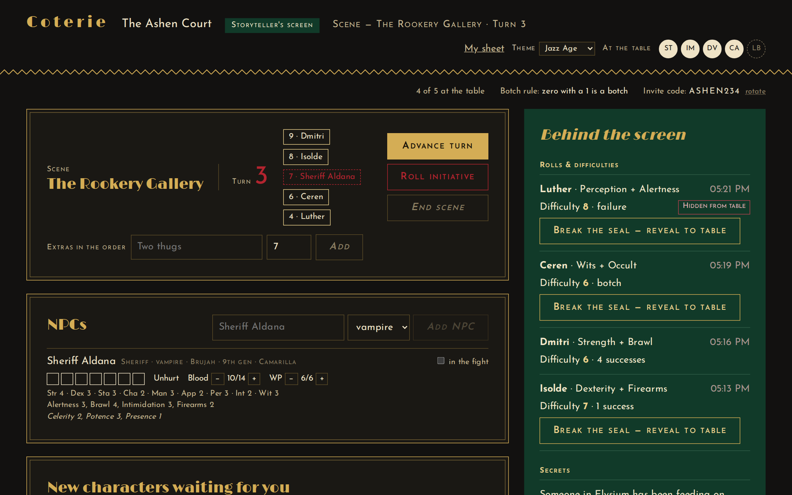
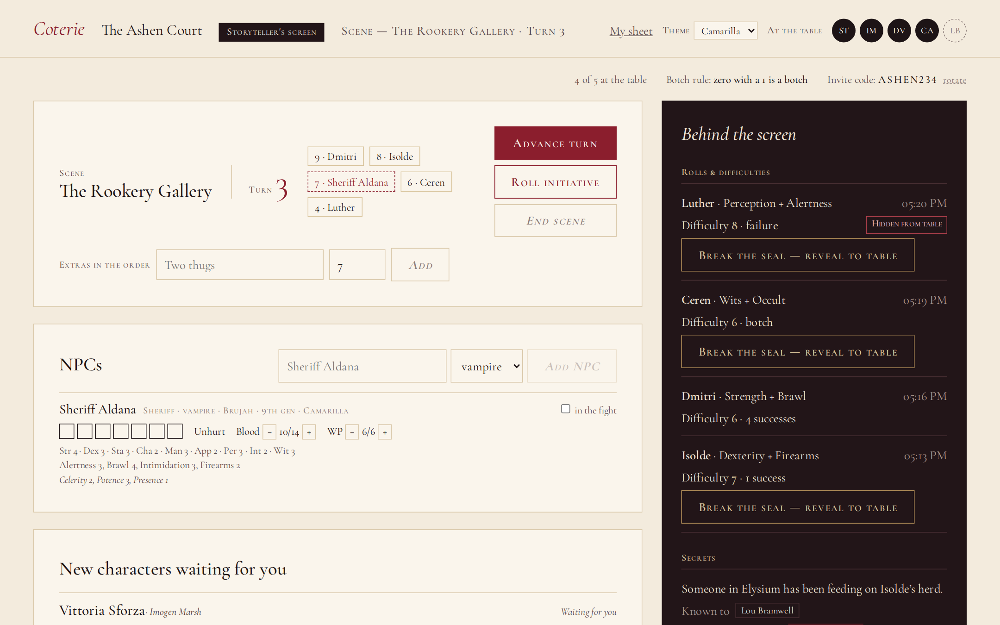

# Coterie

**Play Vampire: The Masquerade online with your friends, all at one shared table.**

### 🦇 [Open Coterie](https://coterie-staging.appwrite.network) · 🎲 [Try the demo, no account needed](https://coterie-staging.appwrite.network/demo) · ☕ [Support on Ko-fi](https://ko-fi.com/sleepynavi)

Coterie is a free website for groups who play *Vampire: The Masquerade, 20th Anniversary Edition* (V20). It puts everything you'd normally have on paper (character sheets, dice, blood pools, the Storyteller's notes) into the browser, and it keeps everyone's screen in sync as you play. When someone rolls, spends blood or takes a wound, the whole table sees it straight away.

It works on a laptop, a tablet or a phone. There's nothing to install.

> **New to Vampire: The Masquerade?** It's a tabletop roleplaying game. One person, the **Storyteller**, runs the story and plays everyone the group meets. Everyone else plays a vampire. Together your characters form a **coterie**, a small band of vampires trying to survive the politics and hunger of the night. You roll ten-sided dice to see whether risky things work.

---

## Try it

**Website: [coterie-staging.appwrite.network](https://coterie-staging.appwrite.network)**

1. **Look around first: [open the demo](https://coterie-staging.appwrite.network/demo).** It's a sample table with a ready-made group of characters, and you don't need an account. Use the link at the top of the page to switch between a player's seat and the Storyteller's screen. Nothing you do there is saved, so click everything.
2. **Play for real: [sign in](https://coterie-staging.appwrite.network).** Then do one of these:
   - **Start a campaign.** You become its Storyteller, and you get an invite code to share with your players.
   - **Join a campaign** with the invite code your Storyteller gives you, then build your character.

> Coterie is still being tested. This is its test server, so things may change, and now and then a campaign may need to be reset. Bug reports and ideas are very welcome.

---

## What players can do

- **Make a character, with help.** A step-by-step form walks you through V20 character creation and keeps a running budget of your points. If you go over, you can trim it back or send it to your Storyteller to approve.
- **Keep your sheet in one place.** Attributes, abilities, Disciplines and their powers, backgrounds, merits and flaws, rituals, gear, Humanity or Path, Willpower and health, all on one page. Hover over a dot to see what that rating means.
- **Roll dice.** Pick what you're rolling and press the button. The site rolls the dice, and your result drops in across the top of your screen; your Storyteller sees it there too. Then it goes into the table's roll log for everyone. Often only the Storyteller knows how hard the roll was until they choose to reveal it.
- **Track blood.** Spend blood, heal wounds, and watch the page itself get darker and redder as your character gets hungry.
- **Ask for changes.** Want to raise a skill or buy a new merit? Propose it, and your Storyteller approves it.
- **Upload a portrait** of your character. Only you and your Storyteller can see it.
- **Take notes.** You get a private notepad that nobody else can read, not even the Storyteller, plus a shared **Coterie** page the whole group can write on.
- **Download your sheet as a PDF**, filled in and ready to print.
- **Play more than one character** in the same campaign, and delete ones you're done with.

## What the Storyteller can do

- **Run scenes.** Start a scene, advance turns and roll initiative for everyone, NPCs included.
- **Keep secrets.** Make hidden rolls, set difficulties players can't see, and share secrets with just one or two players.
- **Run the supporting cast.** Keep NPC stat blocks behind the screen and roll for them.
- **Approve things.** Approve new characters and players' proposed changes, and set your own **creation budget** for the campaign if you don't use the book's.
- **Call for a degeneration check, properly.** Write what the character did in your own words. The player then has to deliberately hold a button to face it, and if they fail, the whole table sees their Humanity fall.
- **Build a reference library** of clans, Disciplines, merits, flaws, rituals and house rules, in your own words, for the whole table. New campaigns start with a ready-made library you can edit.
- **Play a character yourself** (a DMPC) alongside the group.

## Looking after the table

- **The red card.** Anyone can tap it at any time to stop the current scene. It's anonymous, nobody has to explain why, and only the Storyteller can clear it.
- **The dawn warning.** In the half hour before *your* local sunrise, warm light creeps in from the edges of the screen as a reminder that it's getting late.

## Make it yours

Everyone picks their own look from **Theme** at the top of the page:

| Theme | Feel |
|---|---|
| **Camarilla** | Candlelight and gold leaf. The default. |
| **Classical** | Marble, terracotta and imperial purple. |
| **Dark Ages** | Parchment and red wax in a cold stone crypt. |
| **Toreador** | A glossy fashion magazine. |
| **Jazz Age** | Black lacquer, gold Art Deco and green felt. |
| **Sabbat** | Bone, blackletter and a torn red edge. |
| **Daysleep** | Midnight blue and starlight, starring Rem from *Deadlock*. |

Each theme also renames things to suit its world. In Toreador, for example, you don't roll; you *Perform*. When a character's Humanity drops, each theme shows it in its own way.

There are a few hidden surprises too. We won't spoil them.

## Fair play and privacy

- **Nobody can cheat the dice.** Dice are rolled on the server, never in your browser, so no one can fake a roll.
- **You only see what you're meant to see.** Other players' sheets, the Storyteller's notes, hidden rolls and secret difficulties never reach your screen at all; they aren't just hidden from view.
- **Your private things stay private.** Your notepad, your portrait and your theme choice are yours. The red card never records who raised it.

## Which rules does it use?

Coterie follows **V20**. It supports:

- the thirteen clans and many bloodlines;
- the Camarilla, the Sabbat, the Anarchs and other sects;
- thin-blooded characters (Time of Thin Blood) and dhampirs;
- Paths of Enlightenment, rituals, combination Disciplines and sect titles.

It doesn't include any text from the rulebooks; you and your Storyteller write the descriptions in your own words.

## Support Coterie

Coterie is free, and every feature is free for everyone. If it's made your game nights better and you'd like to say thanks, you can **[buy me a coffee on Ko-fi](https://ko-fi.com/sleepynavi)** ☕. Tips help keep the servers running. They're entirely optional, and they never unlock anything.

## Is it official?

No. Coterie is a free, unofficial fan project, made under Paradox Interactive's [Dark Pack agreement](https://www.paradoxinteractive.com/games/world-of-darkness/community/dark-pack-agreement) for World of Darkness fan content. **Coterie is not official World of Darkness material**, and it isn't made or endorsed by Paradox Interactive or Onyx Path. It's free, with no purchases inside it, and it doesn't reproduce text from the books.

Portions of the materials are the copyrights and trademarks of Paradox Interactive AB, and are used with permission. All rights reserved. For more information please visit [worldofdarkness.com](https://www.worldofdarkness.com).

---

## For developers

Coterie is a SvelteKit web app backed by Appwrite. To learn how it's built and secured, how to run it yourself, and how it's tested, read the **[technical notes](docs/TECHNICAL.md)**.
